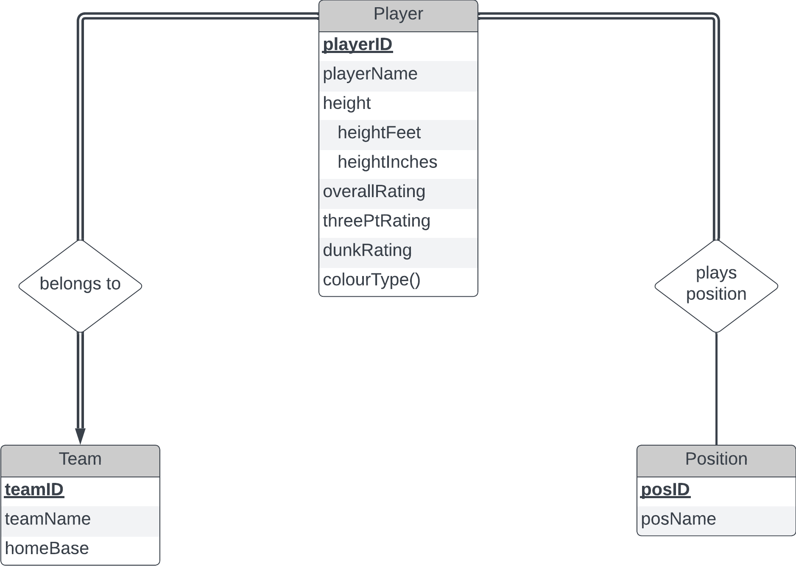
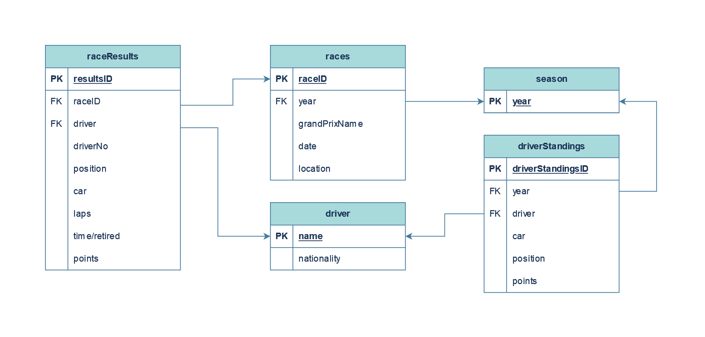

<h1 align="center">Seleksi 1 Warga Basdat 2023: Data Scraping, Data Storing, and Data Visualization from formula1.com</h1>

July 17th 2023 - v01.01

# Description
## Data
Formula 1 .... 

## DBMS
PostgreSQL is used ...

# Specification
Below are the libraries used to run this program.

* *Beautiful Soup*: To scrape the data
* *Requests*: To make requests to URL
* *JSON*: To write JSON encoded data
* *Pandas*: To manipulate dataframes

# How to Use
1. Clone this folder to your local repository
2. Make sure you have the necessary libraries installed. To do that, simply navigate to `Data Scraping/src` and run the following code in your console program such as Command Prompt:
```
pip install -r libs.txt
```
3. Run main.py by running the following code in your console program:
```
python3 main.py
```
4. Follow the instructions in the program as follows. All commands will be done through program.

# JSON Structure
* Driver standings
```
  {
    Pos: driver's final position in the standings
    Driver: driver name
    Nationality: nationality of the driver
    Car: the car the driver drives in
    PTS: points gained in that season
  }
```
* Races in a season
```
  {
    Grand Prix: name of Grand Prix
    Date: date Grand Prix was held
    Winner: winner name
    Car: winner's car
    Laps: laps done by winner
    Time: fastest time set by winner
    Race ID: race ID used by F1 website
    Location: location used by F1 website
  }
```
* Race results
```
  {
    Pos: final position held by driver
    No: driver's number
    Driver: driver name
    Car: driver's car
    Laps: laps done by driver
    Time/Retired: fastest time set by driver/retired status
    Points: points gained by driver
  }
```
# Database Structure
Below are the structures of the database.

## ERD
The following database is designed around the structure of the available data scraped from the Formula 1 website.

The center of this database is the `Season`, which is the year of the championship. A season has many `Races`, so their relationship will be _one-to-many_. Each race has its own results, so `Results` is established as its own entity and having a _one-to-one_ relationship with `Races`. 

A `Driver` is its own entity. In the Formula 1 website, drivers aren't assigned IDs. so the primary key will be their names in this database. Driver's numbers also can't be used to identify drivers, because they can change every year - for example, before Max Verstappen won his first championship in 2021, he raced with the number 33, not 1 (number 1 is usually reserved for championship winners). In other real life examples of databases, people should be assigned unique IDs and not just be uniquely identified by name.
d
`Results` contain the results of multiple drivers of each race, so it has a _one-to-many_ relationship. `DriverStandings` is also its own entity. A driver standings keeps track of many drivers at the same time, so its relationship with `Driver` is _one-to-many_.

The final diagram is as follows:



## Relational diagram



# ERD to Relational Diagram Translation Process


# Screenshots

# References
## Documentation
## Articles


# Author
Ilmagita Nariswari (18221101)
Information System and Technology
Institut Teknologi Bandung
